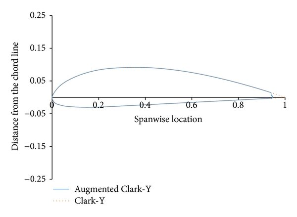
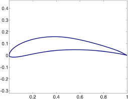
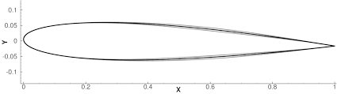
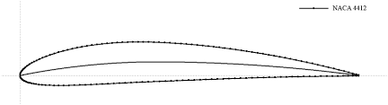
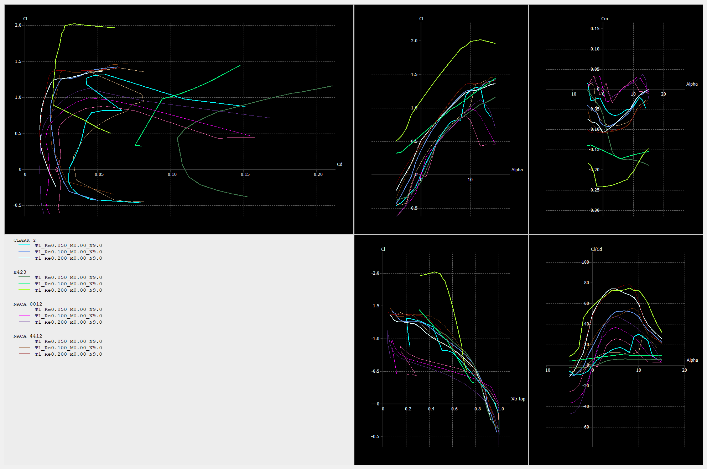

# Airfoil Aerodynamic Analysis at Low Reynolds Numbers using XFLR5

---

##  Project Overview

Low Reynolds number aerodynamics plays a critical role in the performance of small UAVs, gliders, RC aircraft, and low-speed flight applications. At low Reynolds numbers (Re < 300,000), aerodynamic behavior differs significantly from classical high-Re flow regimes due to:

- Increased laminar flow dominance
- Early boundary layer separation
- Strong sensitivity to airfoil geometry
- Transition effects influencing performance

This project investigates the aerodynamic performance of selected airfoils under low Reynolds number conditions using XFLR5 viscous analysis. The objective is to understand how geometric differences influence lift, drag, stability, and aerodynamic efficiency.

---

##  Research Objective

To analyze and compare aerodynamic performance of selected airfoils at low Reynolds numbers and identify design characteristics that influence efficiency and stall behavior.

Key research questions:

- How does airfoil geometry affect lift-to-drag performance at low Reynolds numbers?
- How do stall characteristics vary between different airfoil profiles?
- Which airfoil characteristics are more suitable for endurance-focused low-speed applications?

---

##  Hypothesis

- Increased camber improves lift generation at low Reynolds numbers but may increase drag penalties.
- Thin or optimized low-Re airfoils may demonstrate higher L/D ratios but sharper stall characteristics.
- Aerodynamic performance will show strong sensitivity to Reynolds number variations.

---

##  Methodology

### Software and Analysis Method

- Software: XFLR5
- Solver: XFOIL-based viscous analysis
- Flow model: 2D steady-state analysis

---

### Simulation Parameters

| Parameter | Value |
|---|---|
| Reynolds Numbers | 50,000 / 100,000 / 200,000 |
| Mach Number | 0.05 |
| Ncrit | 9 |
| Angle of Attack Range | -5° to 15° |
| Panel Resolution | 200 |

---

### Controlled Variables

- Same solver settings used across all airfoils
- Identical Reynolds number cases
- Same angle-of-attack sweep
- Consistent panel resolution

---

### Variable Parameters

- Airfoil geometry (camber, thickness distribution, leading-edge shape)

---

##  Airfoils Investigated

### Clark Y


### Eppler (E423)


### NACA 0012


### NACA 4412


---

## Comparison Images

### Reynolds Number = 50,000


### Reynolds Number = 100,000


### Reynolds Number = 200,000


---

##  Performance Metrics

The following aerodynamic metrics were analyzed:

- Lift coefficient (Cl)
- Drag coefficient (Cd)
- Lift-to-drag ratio (L/D)
- Pitching moment coefficient (Cm)
- Stall angle
- Lift curve slope (Clα)

---

##  Results



Suggested plots:

- Cl vs Angle of Attack
- Cd vs Angle of Attack
- L/D vs Angle of Attack
- Polar plots
- Pressure coefficient (Cp) distribution

---

##  Analysis and Discussion

Example observations:

- Airfoil A shows higher maximum lift but increased drag penalty.
- Airfoil B demonstrates smoother stall behavior, indicating improved boundary layer stability.
- Reynolds number sensitivity suggests increased laminar separation effects at lower Re.

Discussion points:

- Influence of camber on pressure recovery
- Laminar separation bubble effects
- Stability implications from Cm trends

---

## 📐 Comparison with Theory (Optional)

Comparison with thin airfoil theory:

- Lift slope theoretical value ≈ 2π per radian.

Discuss deviations and possible reasons such as viscous effects and low Reynolds number flow behavior.

---

##  Limitations

- XFOIL-based methods may be inaccurate near stall or under highly separated flow conditions.
- Results represent 2D aerodynamic behavior and do not account for 3D effects.
- Transition modeling depends on Ncrit parameter assumptions.

---

##  Future Work

- CFD validation using higher-fidelity solvers
- Wind tunnel testing comparison
- Optimization-based airfoil selection
- Extension to 3D wing analysis

---
##  Repository Structure

```
airfoils/
├── clarky/
├── e423/
├── naca0012/
├── naca4412/

comparison/
├── Re50000.png
├── Re100000.png
├── Re200000.png

methodology/
├── simulation_settings.md
```

---

##  References

- XFLR5 Documentation
- XFOIL Methodology Papers
- Low Reynolds Number Airfoil Research Literature

---

##  Author

<ins>**Kritan Kaushik**<ins/>

